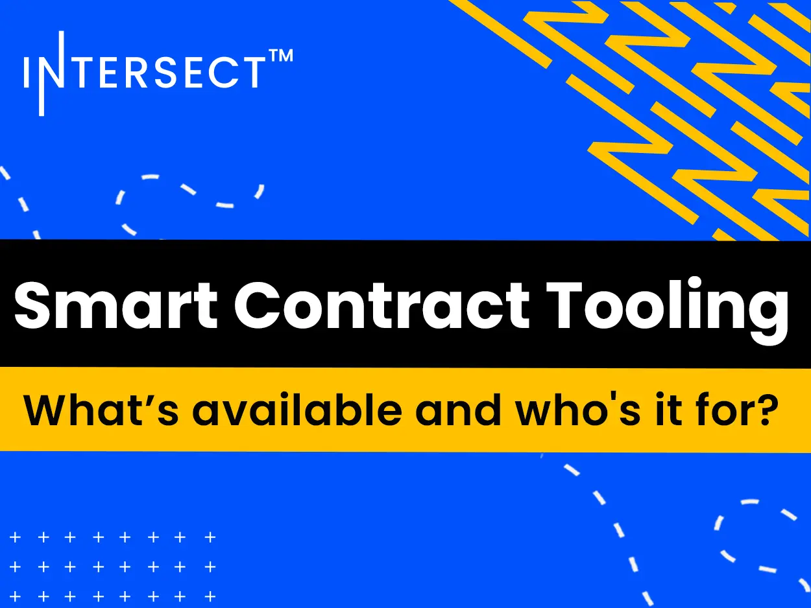

Intersect, collaborating with SundaeLabs and Xerberus, has developed smart contract tooling to manage Cardano's treasury. This system features on-chain contracts to hold funds, a web-based dashboard for administration, and a financial dashboard for transparent tracking. The tools enhance usability and auditability, making it easier for the community to follow the flow of treasury funds from budget approval to vendor payment, thereby improving accountability for community-approved budgets.

 [**Read more**](https://www.intersectmbo.org/news/smart-contract-tooling-whats-available-and-whos-it-for) 

 

