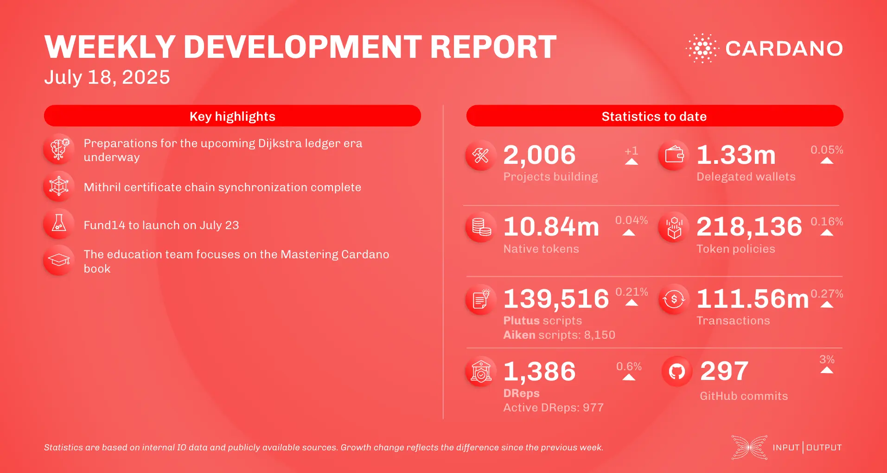

The July 18, 2025, development report highlights the ledger team's focus on preparing for the Dijkstra era, including integrating it into consensus and reducing technical debt. Scaling work saw the Mithril team complete certificate chain synchronization and the Leios team achieve milestones in protocol analysis, including successful high-throughput experiments. Ecosystem news includes Emurgo launching the Cardano Card, Intersect forming an oversight committee for treasury management, and Blockchain.com's DeFi wallet adding support for ada.

 [**Read more**](https://www.essentialcardano.io/development-update/weekly-development-report-as-of-2025-07-18) 

 

