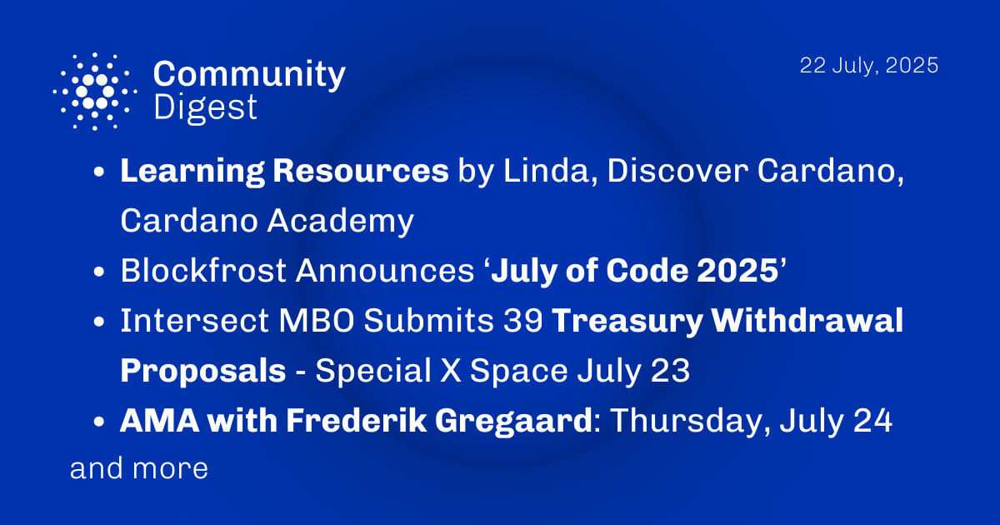

The July 22, 2025, Cardano Community Digest highlights new learning resources from Linda at Discover Cardano and Cardano Academy. It features Blockfrost's "July of Code 2025" event, encouraging developer participation. Additionally, the digest announces an Intersect X Space on July 23 covering 39 treasury proposals and an upcoming AMA with Cardano Foundation CEO Frederik Gregaard on July 24, offering direct engagement opportunities for the community.

 [**Read more**](https://forum.cardano.org/t/digest-july-22-2025-learning-resources-by-linda-discover-cardano-cardano-academy-blockfrost-announces-july-of-code-2025-intersect-mbo-39-treasury-proposals-x-space-july-23-ama-with-frederik-gregaard-july-24/147603) 

 

