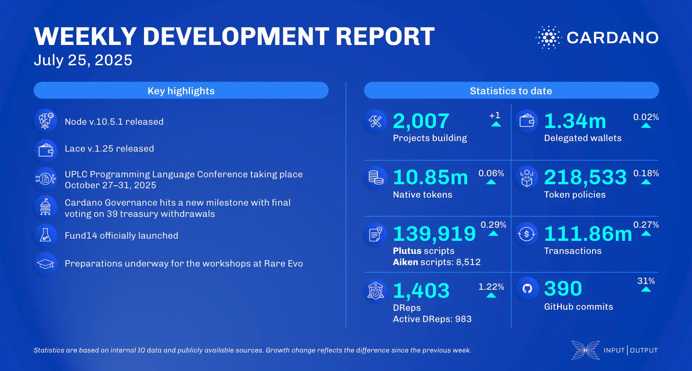

The July 25, 2025, development report highlights the release of node v.10.5.1, featuring networking enhancements and tracing metric fixes. The consensus team is integrating the Dijkstra era and advancing the Haskell Leios simulator. Lace wallet v.1.25 introduced a partnership with NFTPrintLab and support for Bitcoin transaction metadata. The Plutus Core team expanded functionality by introducing case analysis on lists and refined the Plutus Core specification.

 [**Read more**](https://www.essentialcardano.io/development-update/weekly-development-report-as-of-2025-07-25) 

 

