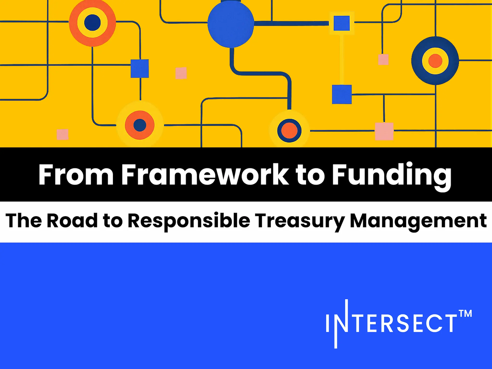

In a July 31 blog post, Intersect outlined its role in facilitating responsible treasury management for Cardano. The post details the journey from establishing a governance framework to enabling on-chain funding. Key components include clear administration policies, a smart contract framework for automated and auditable fund disbursement, and an independent Oversight Committee for verification. This infrastructure supports a secure, community-led process for managing ecosystem funds.

 [**Read more**](https://www.intersectmbo.org/news/from-framework-to-funding-the-road-to-responsible-treasury-management) 

 

