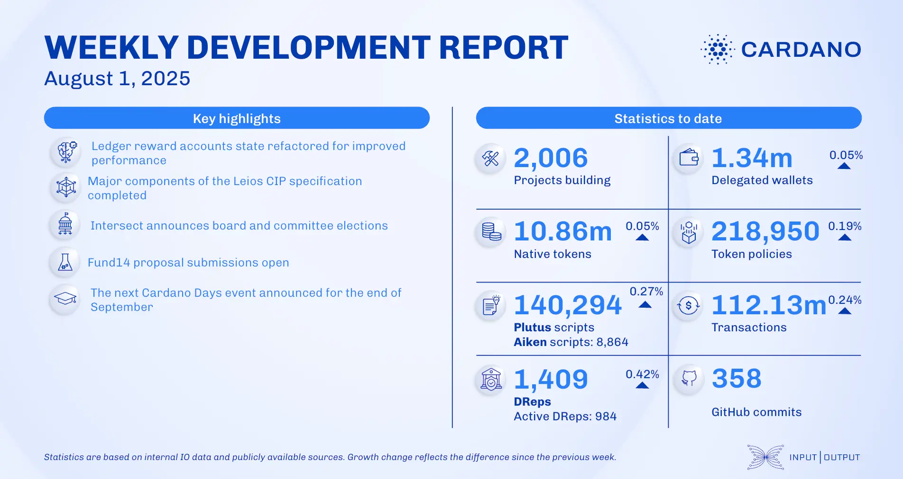

The August 01, 2025, development report highlights a major refactoring of the ledger codebase's reward account state, removing pointers in the Conway era to improve performance and pave the way for future features like the Leios protocol. This update also introduced a feature for reporting the pre-image of script integrity hashes on validation failures. Ecosystem news includes the launch of the Cardano Foundation's Tool Compass and the release of Midnight's tokenomics whitepaper.

 [**Read more**](https://www.essentialcardano.io/development-update/weekly-development-report-as-of-2025-08-01) 

 

