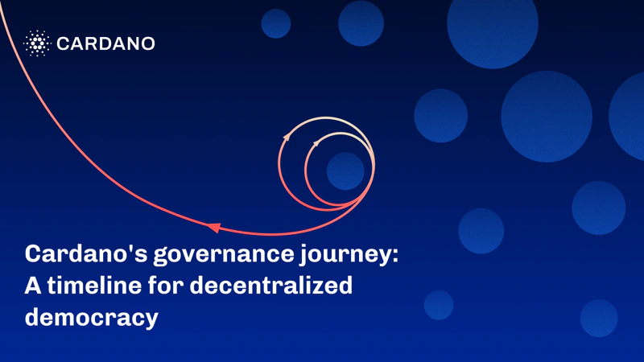

A blog post by Ivan Irakoze on August 3, 2025, details Cardano's three-year journey towards decentralized governance. It chronicles the key milestones, from community workshops to the establishment of the Cardano Constitution and elected representatives. This process culminated in a fully autonomous, on-chain democratic system, empowering ada holders to shape the future of the protocol through direct participation and voting.

 [**Read more**](https://iohk.io/en/blog/posts/2025/08/04/cardanos-governance-journey-a-timeline-for-decentralized-democracy-1/) 

 

