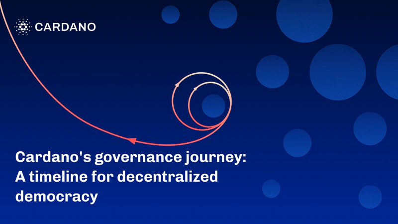

The journey toward decentralized governance has spanned three years, marking a transition from foundational community workshops to a fully autonomous, on-chain democratic system. Key milestones included the establishment of the Constitution and the introduction of elected representatives. This framework empowers ADA holders to shape the protocol's future through direct participation and voting.

 [**Read more**](https://iohk.io/en/blog/posts/2025/08/04/cardanos-governance-journey-a-timeline-for-decentralized-democracy-1/) 

 

