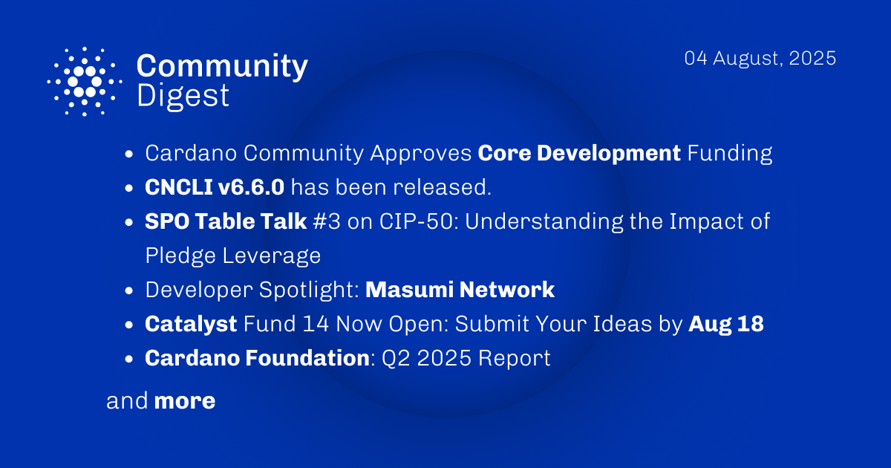

The August 04, 2025, Cardano Community Digest highlights the historic community approval of core development funding and an SPO Table Talk discussing CIP-50. It also features a developer spotlight on the Masumi Network. Additionally, the digest announces that Project Catalyst Fund 14 is now open for proposals and includes a link to the Cardano Foundation's Q2 2025 report, summarizing recent activities and financial insights.

 [**Read more**](https://forum.cardano.org/t/digest-august-04-2025-core-development-funding-spo-table-talk-cip-50-developer-spotlight-masumi-network-catalyst-fund-14-now-open-cardano-foundation-q2-2025-report/147967) 

 

