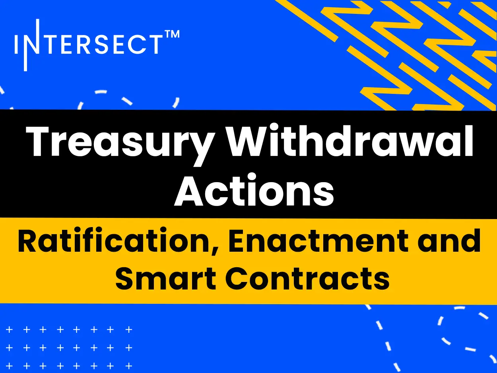

A blog post from August 7 clarifies the process for treasury withdrawal actions. A proposal must first be ratified by achieving a 67% DRep supermajority and CC approval at an epoch boundary. It is enacted at the following epoch, at which point funds are transferred. Intersect then signs a legal contract with the vendor and deploys a smart contract to transparently manage milestone payments.

 [**Read more**](https://www.intersectmbo.org/news/treasury-withdrawal-actions-ratification-enactment-and-smart-contracts) 

 

