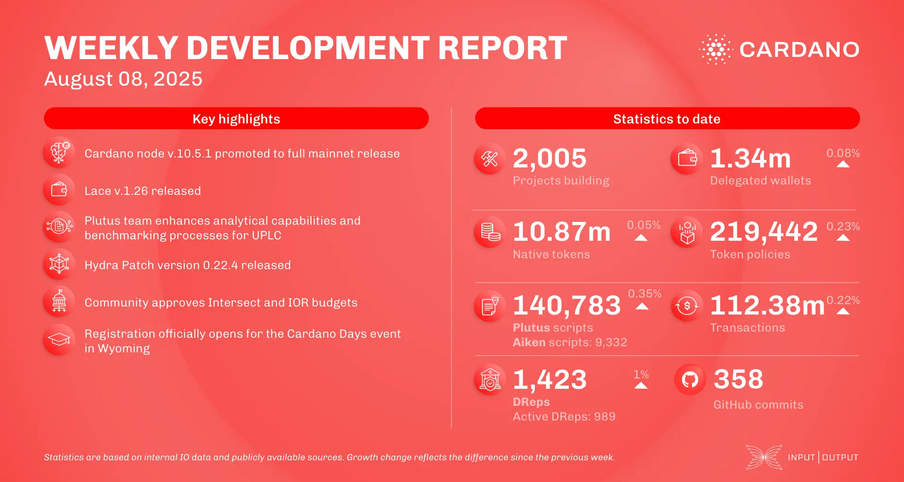

The August 08, 2025, development report highlights the full mainnet release of Cardano node v.10.5.1. The consensus team advanced on multiple fronts, including LSM-tree integration and drafting mini-protocols for Linear Leios. The Plutus team is expanding case analysis support and preparing all built-in functions for the next hard fork. Ecosystem news includes partnerships for Midnight Network with Blockchain.com and Wanchain's bridge to the SUI Network.

 [**Read more**](https://www.essentialcardano.io/development-update/weekly-development-report-as-of-2025-08-08) 

 

