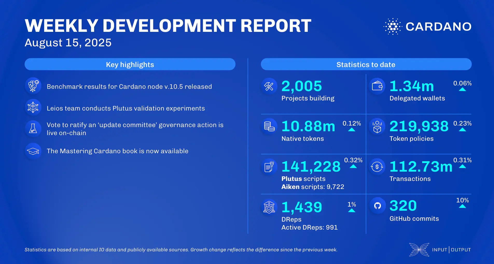

The August 15, 2025, development report highlights the ledger team beginning work on CIP-112, known as 'Required Guards,' and refactoring the stake pool state. The performance team released benchmarks for Cardano node v.10.5. On the scaling front, the Leios team advanced its CIP documentation and demonstrated Linear Leios performance under various Plutus workloads, resolving key simulation discrepancies.

 [**Read more**](https://www.essentialcardano.io/development-update/weekly-development-report-as-of-2025-08-15) 

 

