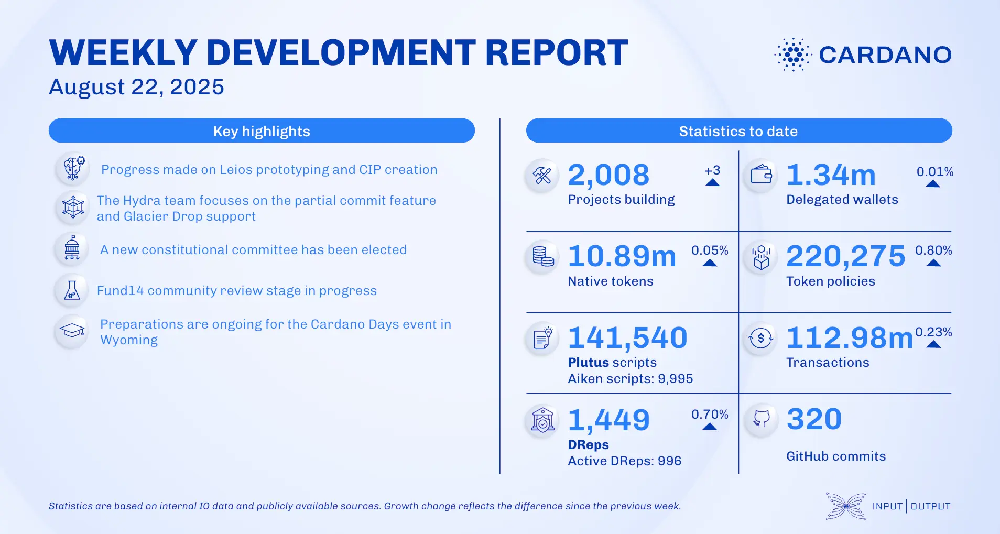

The August 22, 2025, development report highlights the Lace wallet v.1.26 release, which includes performance improvements and bug fixes. The consensus team focused on LSM-tree backend integration and continued Leios prototyping. The Mithril team completed the mock DMQ node implementation, and ecosystem growth reached 2,008 projects. Midnight announced a partnership with Block-rewards, and Liqwid Labs launched a new UI.

 [**Read more**](https://www.essentialcardano.io/development-update/weekly-development-report-as-of-2025-08-22) 

 

