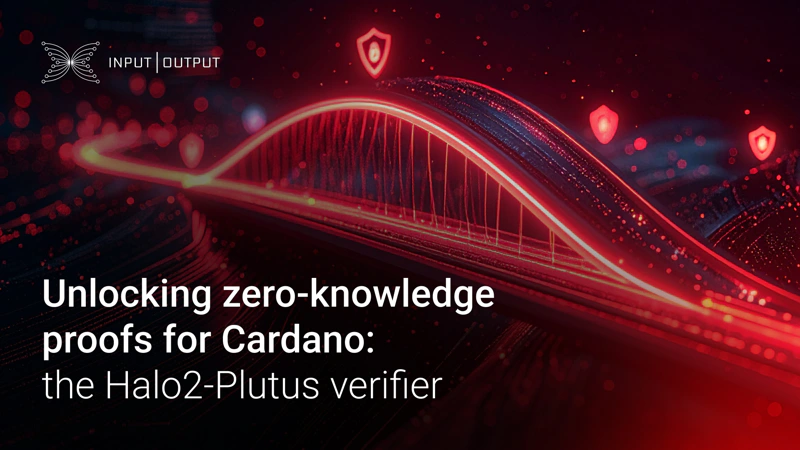

On August 25, 2025, a blog post by Kris Bennett introduced the Halo2-Plutus verifier, an open-source tool for bringing zero-knowledge proofs (ZKPs) to Cardano. Spearheaded by Input | Output Research, this project enables on-chain verification of Halo2 proofs within Plinth smart contracts. This innovation is crucial for enhancing privacy and scalability, with its primary application being the Midnight-Cardano zk-bridge, while also supporting broader use cases like confidential transactions.

 [**Read more**](https://iohk.io/en/blog/posts/2025/08/26/unlocking-zero-knowledge-proofs-for-cardano-the-halo2-plutus-verifier/) 

 

