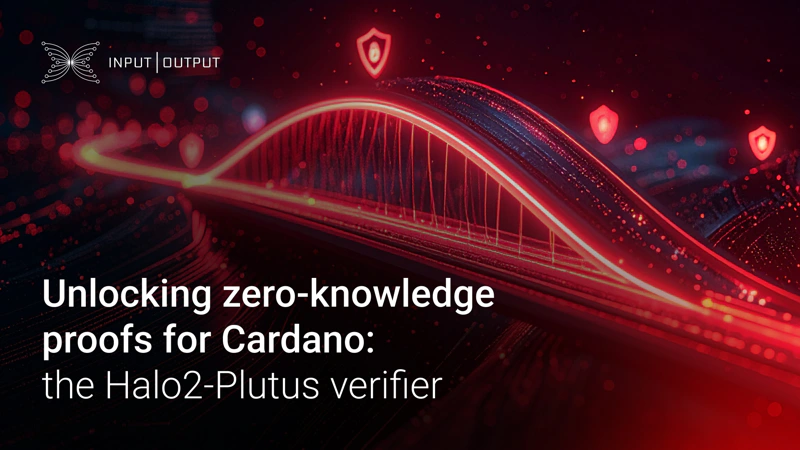

The Halo2-Plutus verifier is an open-source tool designed to bring zero-knowledge proofs (ZKPs) to the network. Developed by Input | Output Research, it enables on-chain verification of Halo2 proofs within Plinth smart contracts. This innovation enhances privacy and scalability, with its primary application being the Midnight-Cardano zk-bridge, while also supporting confidential transactions.

 [**Read more**](https://iohk.io/en/blog/posts/2025/08/26/unlocking-zero-knowledge-proofs-for-cardano-the-halo2-plutus-verifier/) 

 

