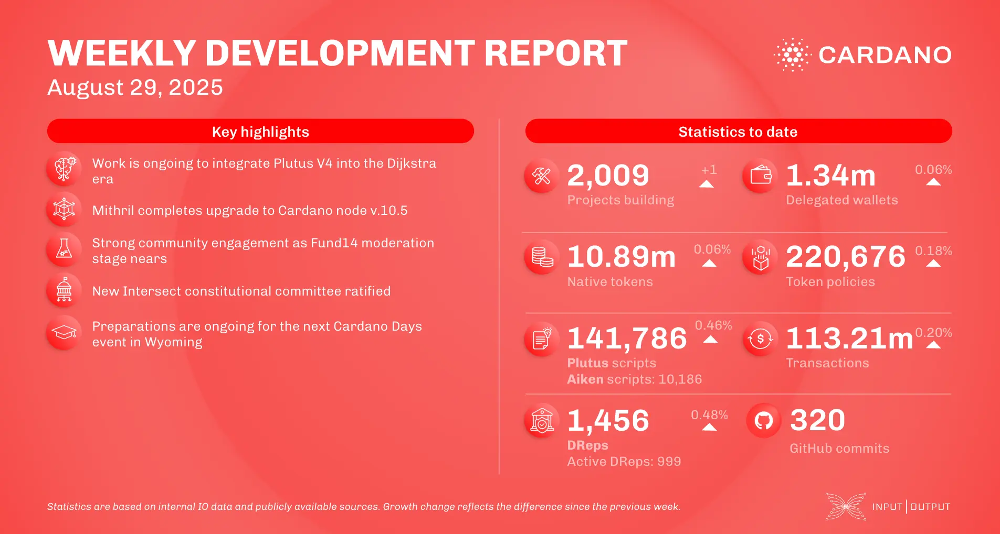

The August 29, 2025, development report highlights the ledger team's work on enforcing stake pool VRF key uniqueness and integrating Plutus V4 into the Dijkstra era. Smart contract development progressed with Plutus Core adding support for built-in lists. Ecosystem news includes Midnight's partnership with Copper, the launch of the Cardano Governance Education Working Group, and the release of the Halo2-Plutus verifier for zero-knowledge proofs.

 [**Read more**](https://www.essentialcardano.io/development-update/weekly-development-report-as-of-2025-08-29) 

 

