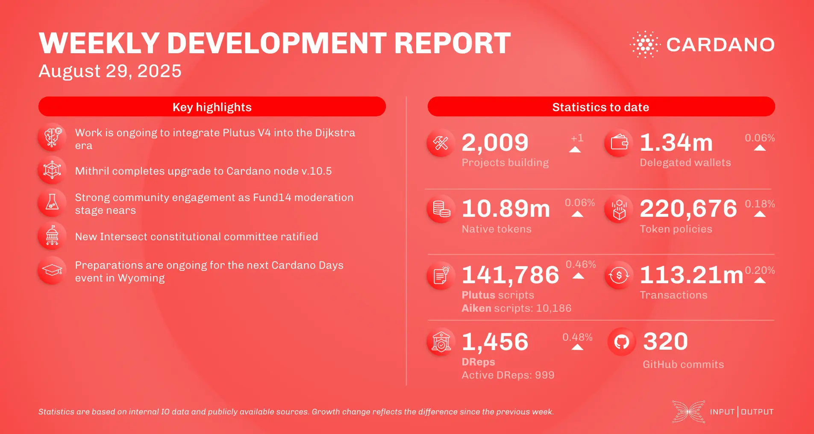

The ledger team is focused on enforcing stake pool VRF key uniqueness and integrating Plutus V4 into the Dijkstra era. Plutus Core has added support for built-in lists, while Midnight partnered with Copper for institutional custody of the NIGHT token. Additionally, the Governance Education Working Group has launched, and the Halo2-Plutus verifier is now available to support on-chain zero-knowledge proofs, primarily for the Midnight-Cardano zk-bridge.

 [**Read more**](https://www.essentialcardano.io/development-update/weekly-development-report-as-of-2025-08-29) 

 

