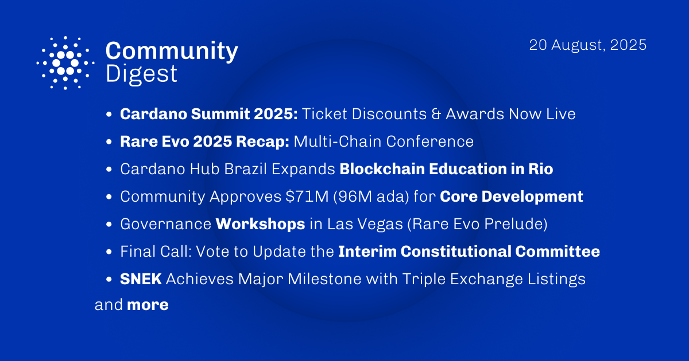

A video recap showcases the events in Las Vegas, highlighting community collaboration and ecosystem progress. An analysis explores the benefits of liquid staking, focusing on how it balances network security with user autonomy. Leios is detailed as a significant scalability milestone for the network's future. Additionally, an on-chain version of a popular game was demonstrated using Hydra to illustrate high-speed transaction capabilities.

 [**Read more**](https://forum.cardano.org/t/digest-september-01-2025-recap-video-of-rare-evo-las-vegas-2025-cexplorer-io-article-benefits-of-liquid-staking-leios-a-major-milestone-in-cardanos-scalability-push-tony-thanh-s-on-chain-flappy-bird-demo/148995) 

 

