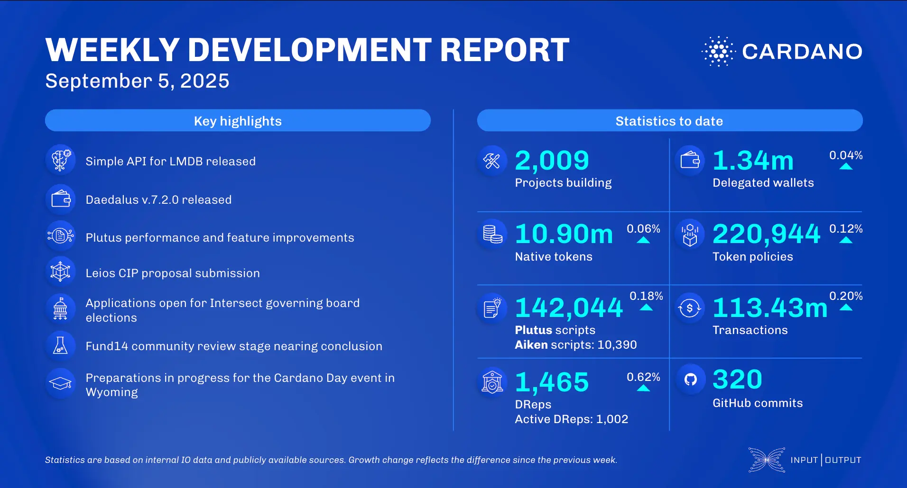

The September 05, 2025, development report highlights the consensus team's work on the first public draft of the Leios CIP, LSM-tree support, and KES agent integration. The Plutus team improved the evaluator and deserializer and added support for built-in units and pairs. In ecosystem news, MLabs launched feeswap.io, the Cardano Foundation rebuilt the Developer Portal, and World Mobile Chain's $WMTX token began trading on KrakenFX.

 [**Read more**](https://www.essentialcardano.io/development-update/weekly-development-report-as-of-2025-09-05) 

 

