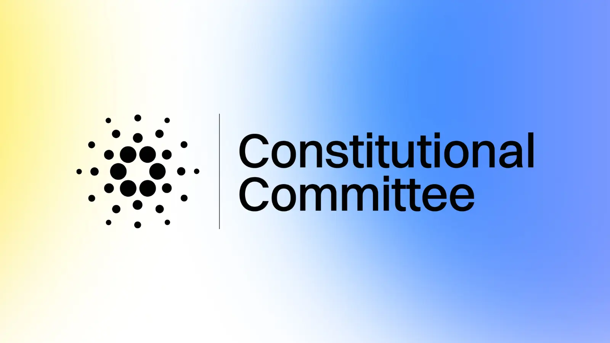

Intersect’s September 7, 2025, blog post recaps the first fully community-led Constitutional Committee election. Seven members were elected via on-chain vote by DReps and SPOs to uphold the Cardano Constitution for the next term. The post details the voting process, which used a one-lovelace-one-vote system, and introduces the newly selected members. This election marks a critical milestone in establishing a robust, decentralized governance framework for the ecosystem.

 [**Read more**](https://www.intersectmbo.org/news/constitutional-committee-elections-2025what-happened-who-was-selected-how-it-worked-and-why-it-matter) 

 

