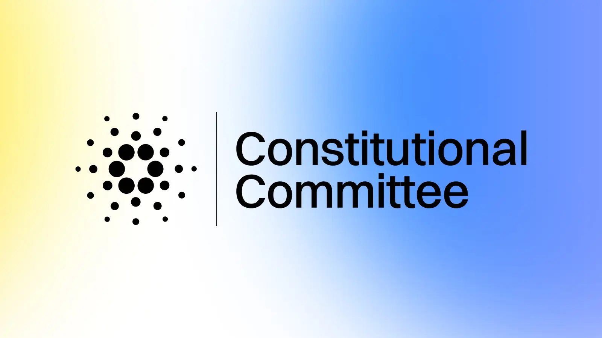

The first community-led Constitutional Committee election has concluded, with seven members elected via an on-chain vote by DReps and SPOs. The process utilized a one-lovelace-one-vote system to select representatives responsible for upholding the Cardano Constitution for the upcoming term. This milestone establishes a decentralized governance framework and marks the full transition of constitutional power to the community.

 [**Read more**](https://www.intersectmbo.org/news/constitutional-committee-elections-2025what-happened-who-was-selected-how-it-worked-and-why-it-matter) 

 

