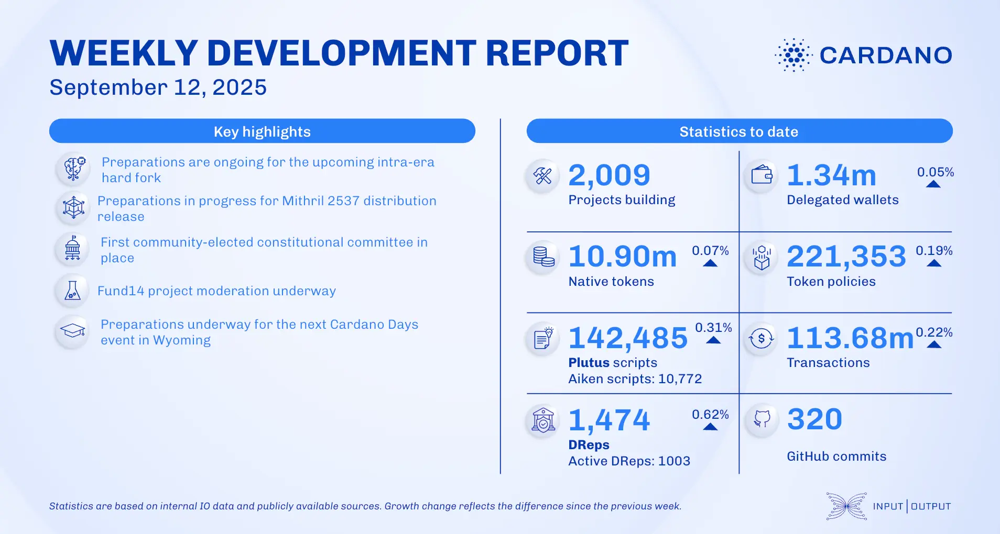

The September 12, 2025, development report highlights the ledger team's progress on CIP-112 and features for the next intra-era hard fork. A major Voltaire milestone was reached with the first fully community-elected constitutional committee now in place. In scaling, the Mithril team updated the DMQ protocol CIP. Ecosystem news includes the release of Yoroi Extension v.5.13.0 and new partnerships for Sundial Protocol and Midnight Network.

 [**Read more**](https://www.essentialcardano.io/development-update/weekly-development-report-as-of-2025-09-12) 

 

