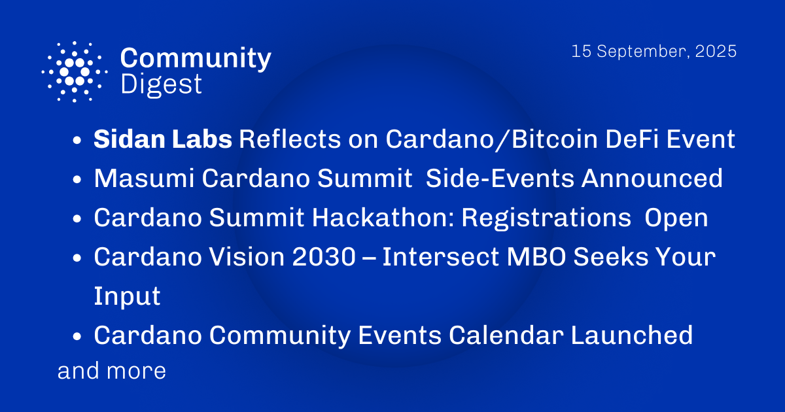

The September 15, 2025, Cardano Community Digest highlights reflections from SIDAN Labs on the recent Cardano-Bitcoin DeFi event. It also announces Masumi side events for the upcoming Cardano Summit and that hackathon registrations are now open. The digest features IntersectMBO's Cardano Vision 2030 initiative and the launch of a new, centralized Cardano Community Events Calendar, aimed at improving coordination across the ecosystem.

 [**Read more**](https://forum.cardano.org/t/digest-september-15-2025-sidan-labs-reflects-on-cardano-bitcoin-defi-event-masumi-cardano-summit-side-events-announced-cardano-summit-hackathon-registrations-now-open-intersectmbo-cardano-vision-2030-cardano-community-events-calendar-launched/149416) 

 

