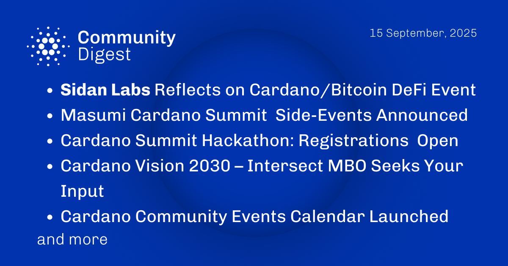

SIDAN Labs shared reflections on the Cardano-Bitcoin DeFi event, while Masumi side events and hackathon registrations for the upcoming Cardano Summit were announced. Intersect introduced the Cardano Vision 2030 initiative, and a new centralized Community Events Calendar has launched to improve coordination.

 [**Read more**](https://forum.cardano.org/t/digest-september-15-2025-sidan-labs-reflects-on-cardano-bitcoin-defi-event-masumi-cardano-summit-side-events-announced-cardano-summit-hackathon-registrations-now-open-intersectmbo-cardano-vision-2030-cardano-community-events-calendar-launched/149416) 

 

