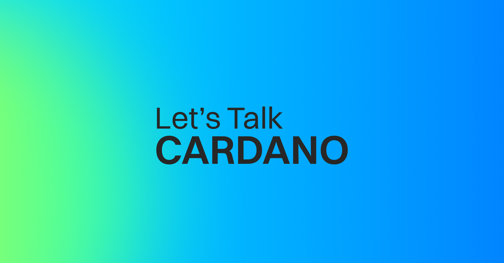

In a "Let's Talk Cardano" episode summary from September 17, 2025, the Cardano Foundation's Veridian digital identity platform was explored. Authored by Laura Mattiucci, the post details how Veridian, built on Cardano and the KERI protocol, tackles digital trust issues. It features quantum-resistant key management and decouples identity from public keys for interoperability, using the blockchain as a root of trust for its global security monitoring service.

 [**Read more**](https://cardanofoundation.org/blog/lets-talk-cardano-veridian) 

 

