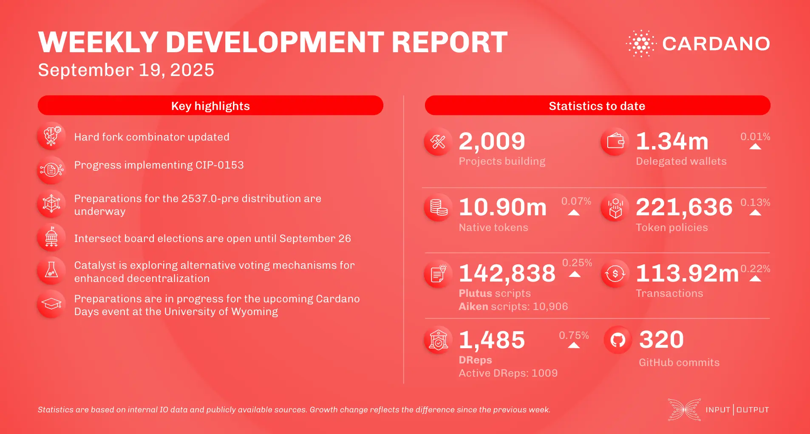

The September 19, 2025, development report highlights the consensus team drafting an architectural design for Leios (CIP-0164). The Plutus team progressed on implementing the Value built-in type (CIP-0153) and merged multi-scalar multiplication primitives for the next hard fork. In scaling, the Mithril team created a new pre-release, supported Cardano node v.10.5.1, and completed a SNARK proving circuit prototype. IOG also kicked off its 2025 Asia tour.

 [**Read more**](https://www.essentialcardano.io/development-update/weekly-development-report-as-of-2025-09-19) 

 

