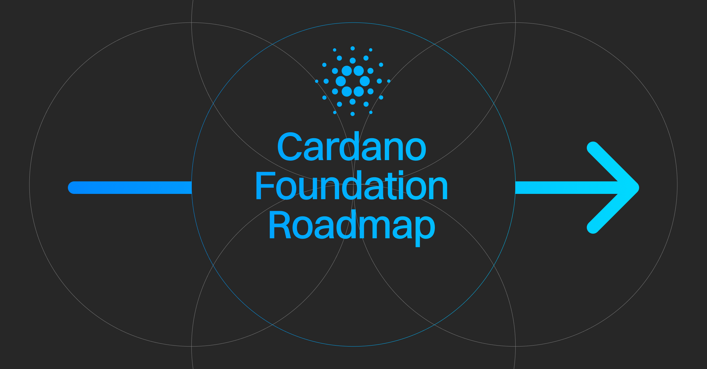

On September 23, 2025, Cardano Foundation CEO Frederik Gregaard unveiled an updated roadmap focused on accelerating global adoption. Key initiatives include injecting eight figures in ada liquidity into DeFi, expanding the Web3 adoption team, and committing up to 2 million ada to the Cardano Venture Hub in 2026. The plan also prioritizes Real-World Asset tokenization, increases the 2026 marketing budget by 12%, and boosts governance decentralization by delegating an additional 220M ada to select DReps.

 [**Read more**](https://cardanofoundation.org/blog/cardano-foundation-roadmap) 

 

