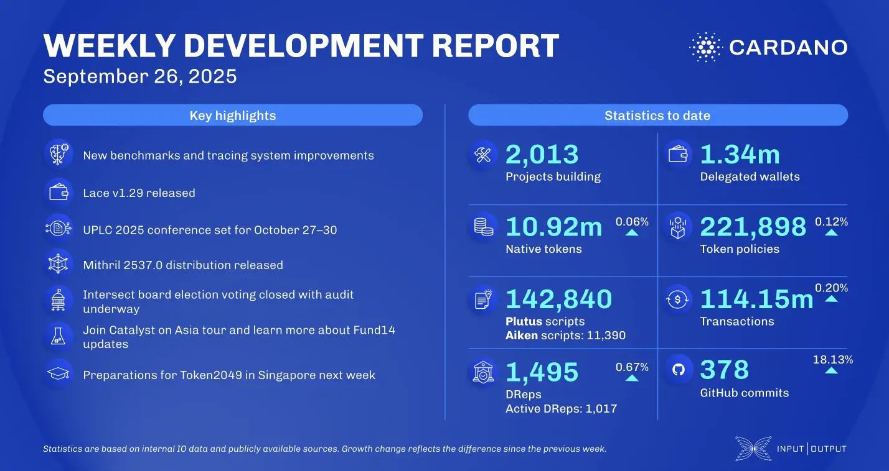

The September 26, 2025, development report highlights the consensus team's work on the KES agent audit and refactoring the hard fork combinator to be Peras-aware. The Plutus team is preparing for the intra-era hard fork by enabling sums-of-products and built-in functions across all Plutus versions. In the ecosystem, IOG announced a partnership with zkFold to build a trustless ETH-Cardano bridge, while Minswap's "Wen" token generator is now live.

 [**Read more**](https://www.essentialcardano.io/development-update/weekly-development-report-as-of-2025-09-26) 

 

