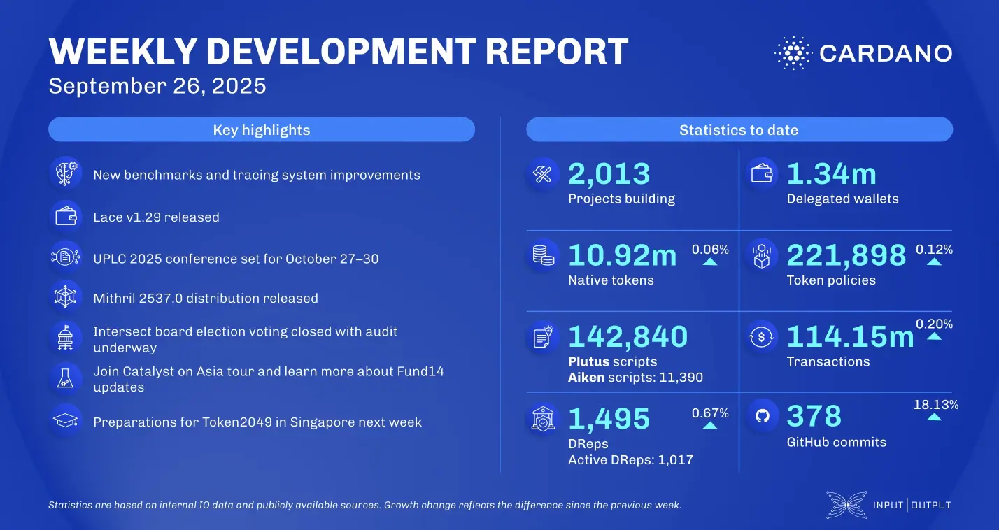

The consensus team is auditing the KES agent and refactoring the hard fork combinator for Peras-awareness. The Plutus team is enabling sums-of-products and built-in functions for the upcoming intra-era hard fork. Meanwhile, IOG and zkFold have partnered for a trustless ETH-Cardano bridge, and Minswap's "Wen" token generator is now live.

 [**Read more**](https://www.essentialcardano.io/development-update/weekly-development-report-as-of-2025-09-26) 

 

