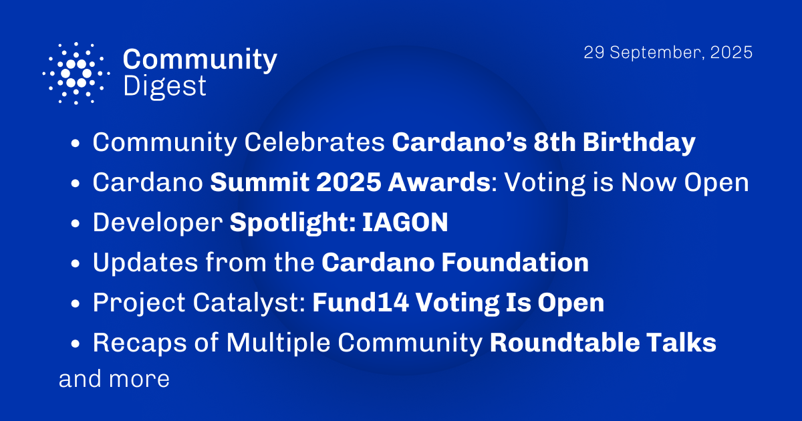

The September 29, 2025, Cardano Community Digest celebrates Cardano's 8th birthday, reflecting on its journey from Byron to Voltaire. It also announces that voting for the Cardano Summit 2025 Awards is now open. The digest features a developer spotlight on Iagon and recaps recent Roundtable Talks. Updates from the Cardano Foundation and Project Catalyst are also included, with the announcement that Fund14 voting is now open.

 [**Read more**](https://forum.cardano.org/t/digest-september-29-2025-celebrating-cardanos-8th-birthday-cardano-summit-2025-awards-voting-is-now-open-developer-spotlight-iagon-cardano-foundation-updates-project-catalyst-fund14-voting-is-open-recaps-of-community-roundtable-talks/149910) 

 

