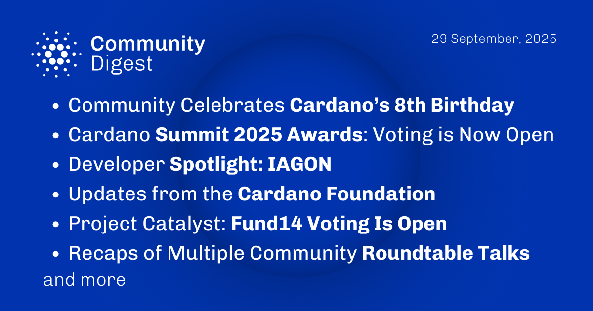

The ecosystem is celebrating its 8th anniversary, reflecting on its journey from Byron to Voltaire. Voting for the 2025 Summit Awards is officially open, and a developer spotlight features Iagon. Additionally, recent Roundtable Talks were recapped, and Project Catalyst Fund14 voting has launched.

 [**Read more**](https://forum.cardano.org/t/digest-september-29-2025-celebrating-cardanos-8th-birthday-cardano-summit-2025-awards-voting-is-now-open-developer-spotlight-iagon-cardano-foundation-updates-project-catalyst-fund14-voting-is-open-recaps-of-community-roundtable-talks/149910) 

 

