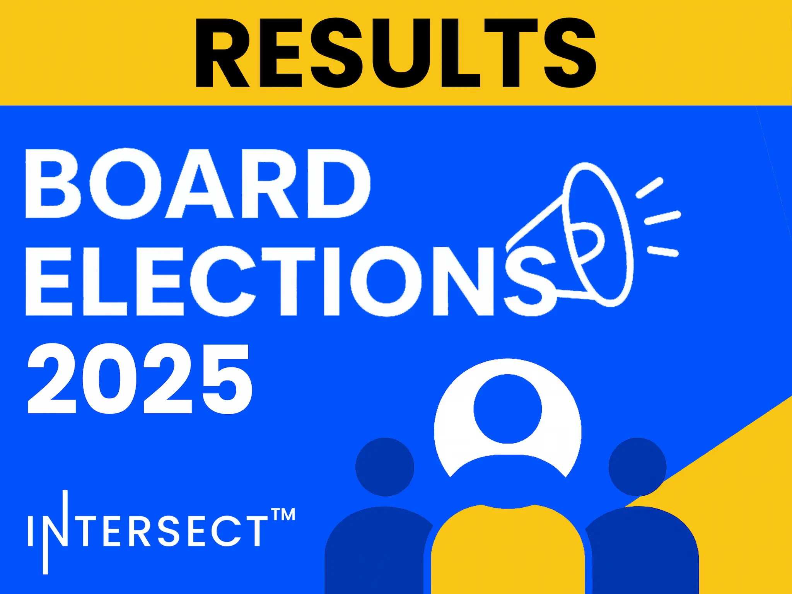

On October 1, 2025, Intersect announced the results of its 2025 board elections, with Adam Rusch and Jack Briggs being elected as new members. This election is a significant milestone for Cardano's governance, as it marks the first time a majority of the Intersect board has been directly elected by its members. The result, determined by a 26% voter turnout, reinforces the ecosystem's commitment to decentralized, community-led decision-making.

 [**Read more**](https://www.intersectmbo.org/news/intersect-announces-results-of-2025-board-elections) 

 

