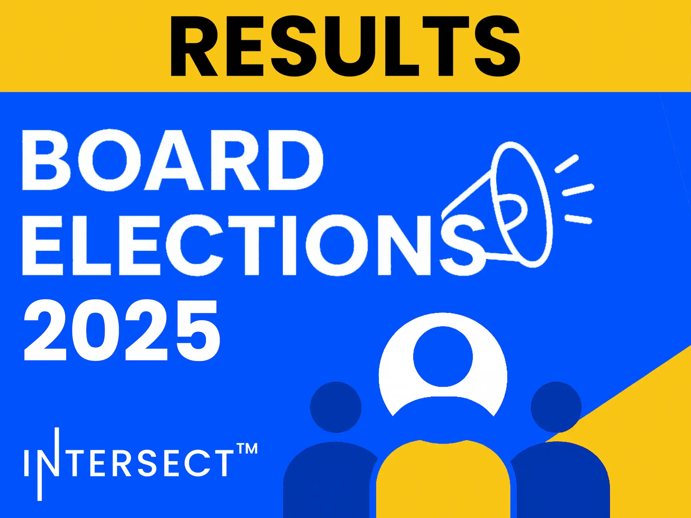

Intersect board election results have been announced, with Adam Rusch and Jack Briggs elected as new members. This milestone marks the first time a majority of the board is directly elected by its members, achieved with a 26% voter turnout to reinforce decentralized, community-led governance.

 [**Read more**](https://www.intersectmbo.org/news/intersect-announces-results-of-2025-board-elections) 

 

