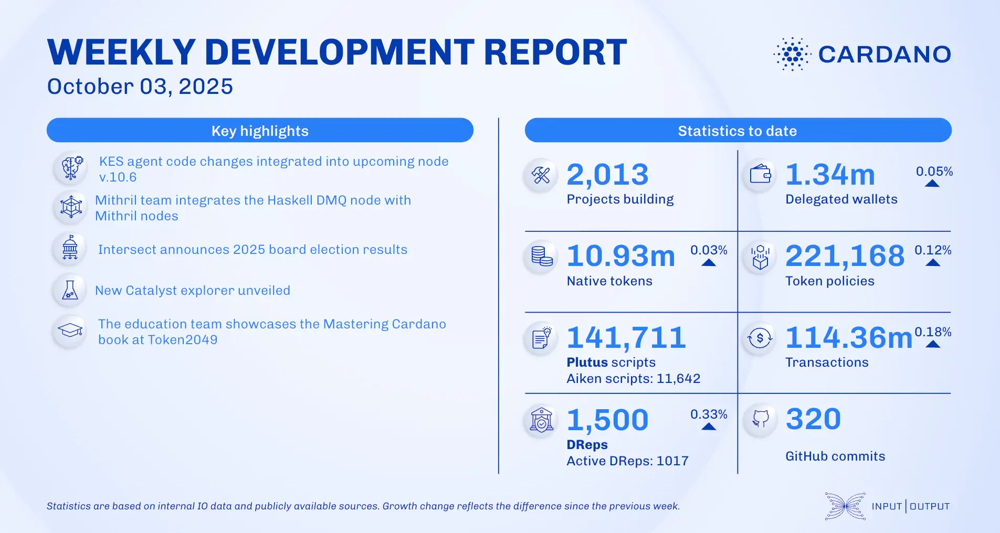

Progress continues on CIP-112 and features for the next intra-era hard fork. The first fully community-elected constitutional committee is now in place, and the Mithril team has updated the DMQ protocol CIP. Additionally, Yoroi Extension v.5.13.0 has been released, alongside new partnerships for Sundial Protocol and Midnight Network.

 [**Read more**](https://www.essentialcardano.io/development-update/weekly-development-report-as-of-2025-10-03) 

 

