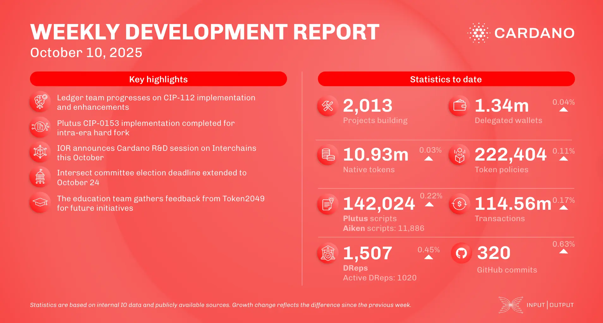

The October 10, 2025, development report highlights steady ecosystem growth, with transaction volume reaching 114.56 million and an increase in active DReps. The IOG team concluded its Asia tour in Tokyo. Yoroi wallet launched v6.0, integrating DexHunter and Minswap. Additionally, Midnight Network partnered with CSWAP to develop privacy-first DeFi solutions, and the Hydra-node v1.0.0 pre-release is now available on GitHub.

 [**Read more**](https://www.essentialcardano.io/development-update/weekly-development-report-as-of-2025-10-10) 

 

