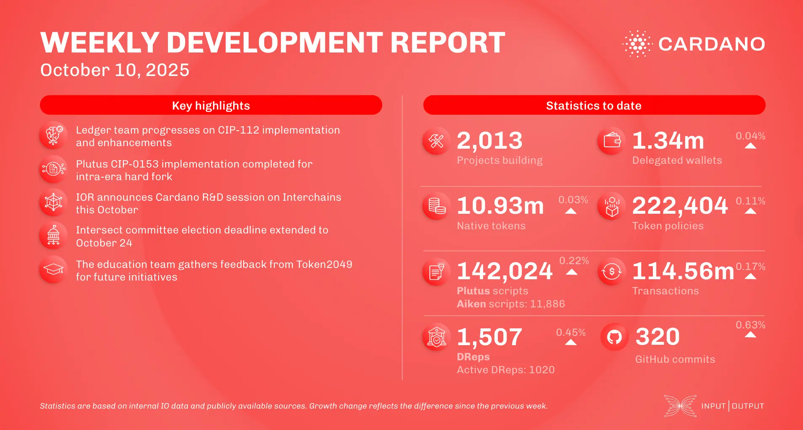

The ecosystem has reached 114.56 million transactions and an increase in active DReps, while the Asia tour concluded in Tokyo. Yoroi v6.0 launched, integrating DexHunter and Minswap. Additionally, Midnight Network partnered with CSWAP for privacy-first DeFi solutions, and the Hydra-node v1.0.0 pre-release is now available.

 [**Read more**](https://www.essentialcardano.io/development-update/weekly-development-report-as-of-2025-10-10) 

 

