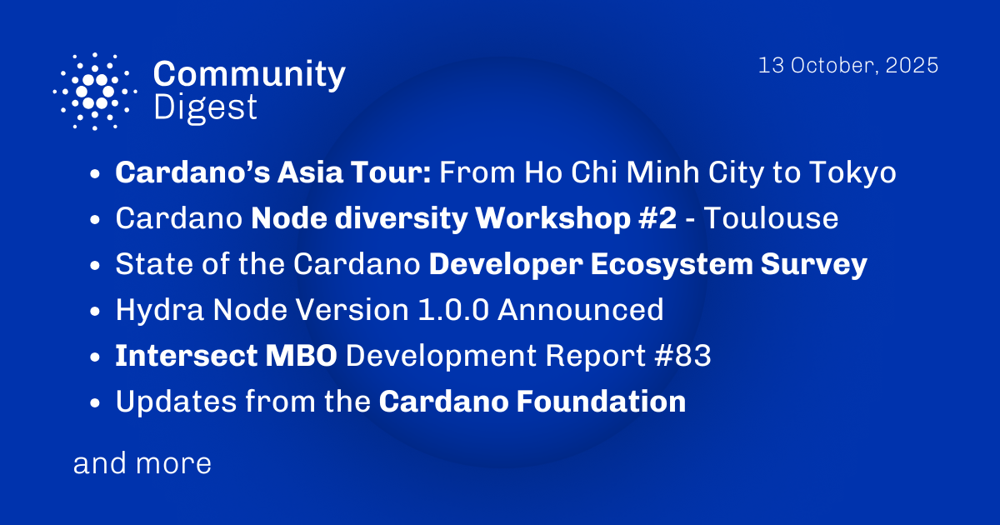

The October 13, 2025, Cardano Community Digest highlights the ongoing Asia Tour, with stops in Ho Chi Minh City and Tokyo, and the Node Diversity Workshop #2 in Toulouse. It also announces the release of Hydra node v1.0.0 and calls for participation in the State of the Cardano Developer Ecosystem survey, alongside other ecosystem updates and a reminder for the Intersect committee elections. 

 [**Read more**](https://forum.cardano.org/t/digest-october-13-2025-cardano-s-asia-tour-from-ho-chi-minh-city-to-tokyo-cardano-node-diversity-workshop-2-toulouse-state-of-the-cardano-developer-ecosystem-survey-hydra-node-version-1-0-0-announced/150393) 

 

