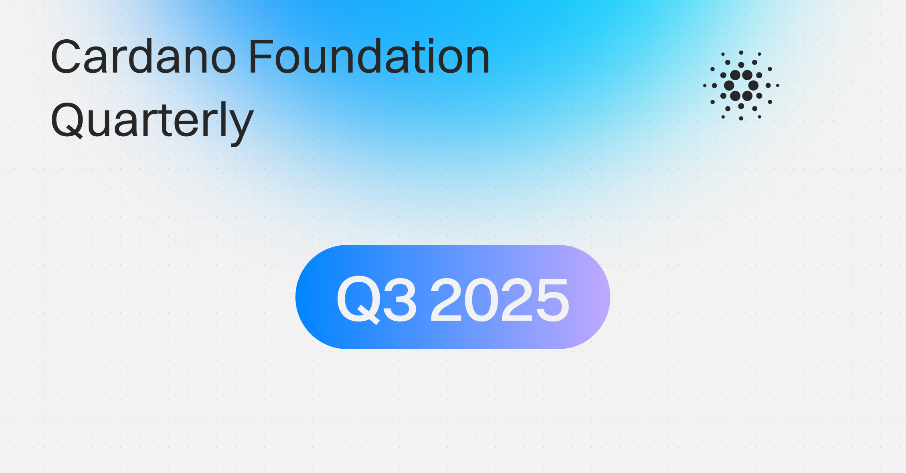

The Cardano Foundation's Q3 2025 report, published on October 17 by Laura Mattiucci, details a focus on adoption, resilience, and education. Key activities included the 2025 Asia Tour, the application process for .ada and .cardano gTLDs, and preparations for the Cardano Summit in Berlin. The quarter also saw major governance milestones, including the seating of the first community-elected Constitutional Committee.

 [**Read more**](https://cardanofoundation.org/blog/quarterly-q3-2025) 

 

