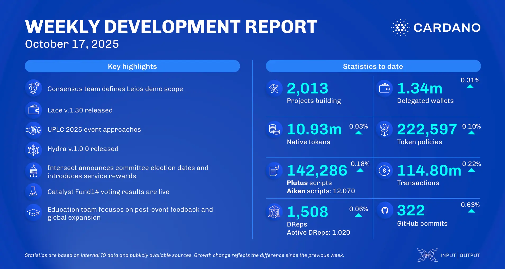

The October 17, 2025, development report highlights the Hydra team's release of version 1.0.0. The consensus team advanced the Leios CIP, while the performance team benchmarked node v.10.6 and the LSM-tree backend. The Plutus team finalized the implementation of CIP-0153, introducing the Value built-in type. In the ecosystem, Project Catalyst Fund14 voting concluded, and the Cardano Foundation launched its Summit 2025 PR campaign.

 [**Read more**](https://www.essentialcardano.io/development-update/weekly-development-report-as-of-2025-10-17) 

 

