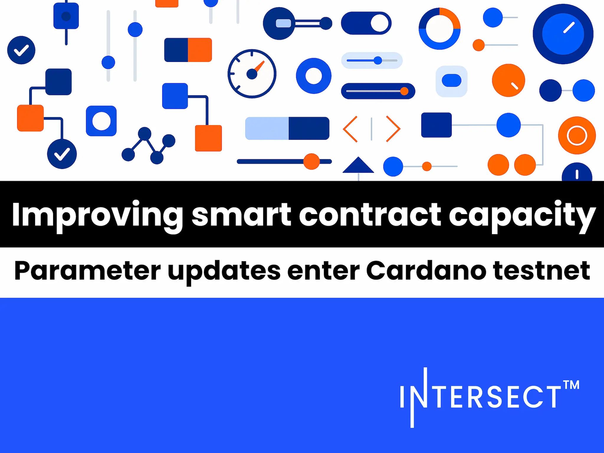

On October 20, 2025, Intersect announced that protocol parameter updates proposed by the Technical Steering Committee have entered the Preview testnet. These changes, which include increasing the block size to 128KB and raising Plutus script memory units per transaction to 20M, are designed to enhance network throughput and support more complex DeFi applications on Cardano.

 [**Read more**](https://www.intersectmbo.org/news/improving-smart-contract-capacity-parameter-updates-enter-cardano-testnet) 

 

