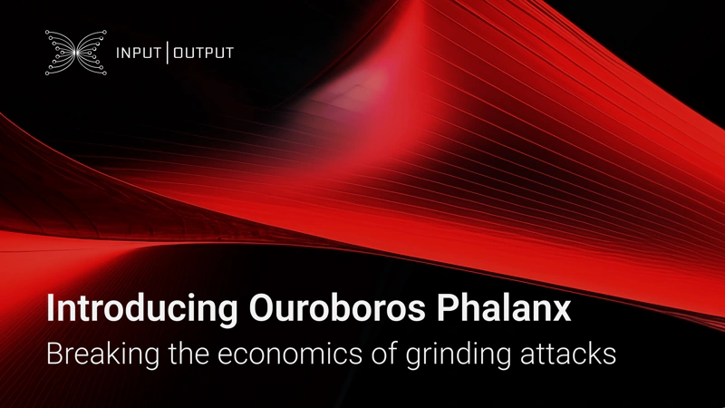

A blog post by Kris Bennett on October 21, 2025, introduces Ouroboros Phalanx, an extension of the Ouroboros Praos consensus protocol. Phalanx strengthens Cardano's security by using verifiable delay functions (VDFs) to make randomness "grinding attacks" economically infeasible. This enhancement not only deters adversaries but also improves network performance, reducing transaction settlement times.

 [**Read more**](https://iohk.io/en/blog/posts/2025/10/22/introducing-ouroboros-phalanx-breaking-the-economics-of-grinding-attacks/) 

 

