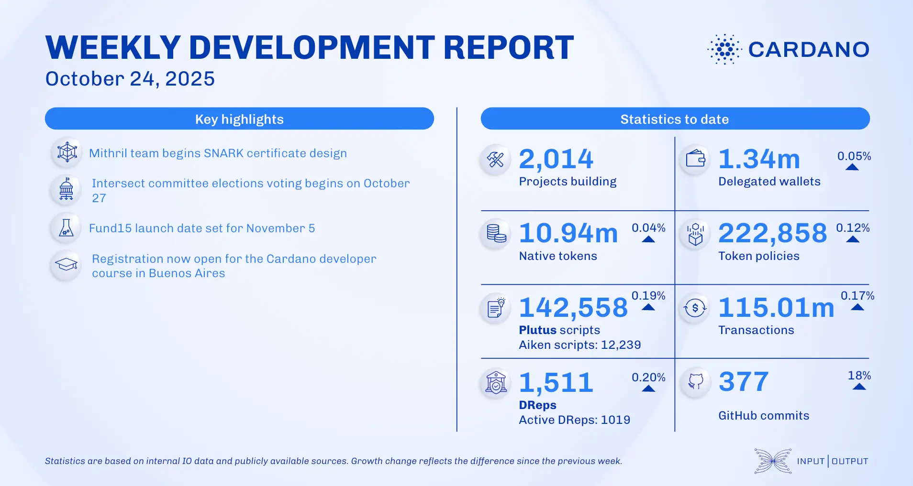

The October 24, 2025, development report highlights ecosystem growth to 2,014 projects and the Cardano Foundation's plan to apply for .ada and .cardano gTLDs. Wanchain launched a bridge to Sonic. The Mithril team advanced incremental snapshots and configuration decentralization. Intersect committee election voting is set to begin October 27, and Project Catalyst announced Fund15 will launch on November 5.

 [**Read more**](https://www.essentialcardano.io/development-update/weekly-development-report-as-of-2025-10-24) 

 

