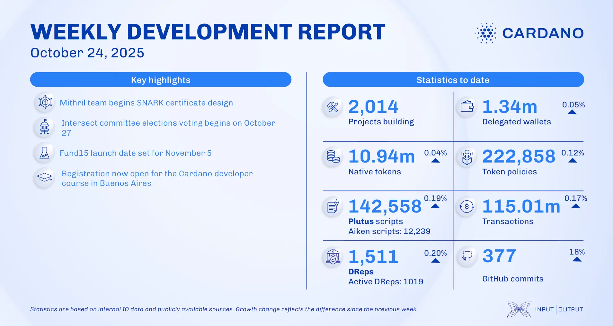

The ecosystem has reached a milestone of 2,014 projects, while applications are being prepared for .ada and .cardano gTLDs. Wanchain has launched a bridge to Sonic, and technical progress continues with Mithril's work on incremental snapshots and configuration decentralization. Furthermore, committee election voting is opening for the community, and Project Catalyst Fund15 is set to launch.

 [**Read more**](https://www.essentialcardano.io/development-update/weekly-development-report-as-of-2025-10-24) 

 

