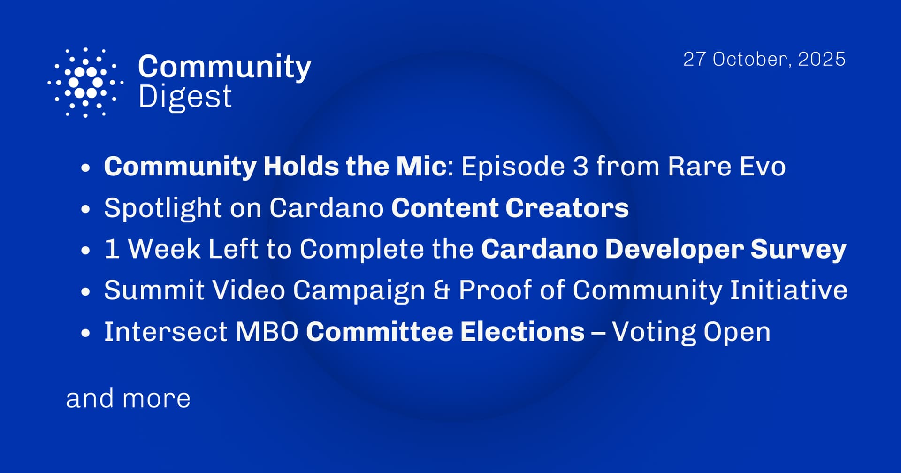

"Community Holds the Mic" explores the ecosystem's culture with insights from Rare Evo. Content creators Kaizen Crypto, Lars Brünjes, and Cardano Whale are featured for their contributions. Additionally, a developer survey remains open for participation, and voting for committee elections is officially active.

 [**Read more**](https://forum.cardano.org/t/digest-october-27-2025-community-holds-the-mic-episode-3-from-rare-evo-spotlight-on-cardano-content-creators-1-week-left-to-complete-the-cardano-developer-survey-community-summit-campaigns-intersect-mbo-committee-elections-voting-open/150774) 

 

