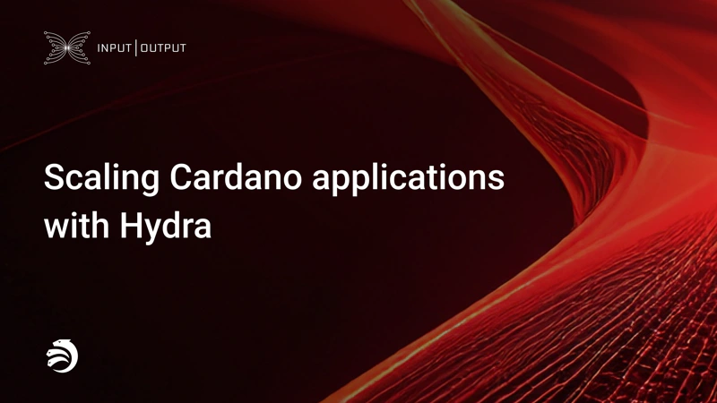

A blog post by Olga Hryniuk on October 26, 2025, announced that the Hydra protocol has reached v1 and is now production-ready. This scaling solution enables high-throughput, low-latency applications by processing transactions off-chain in 'Heads' while retaining layer 1 security. Validated by Midnight’s Glacier Drop, this release delivers a feature-complete protocol, stable API, and interoperability improvements.

 [**Read more**](https://iohk.io/en/blog/posts/2025/10/27/scaling-cardano-applications-with-hydra/) 

 

