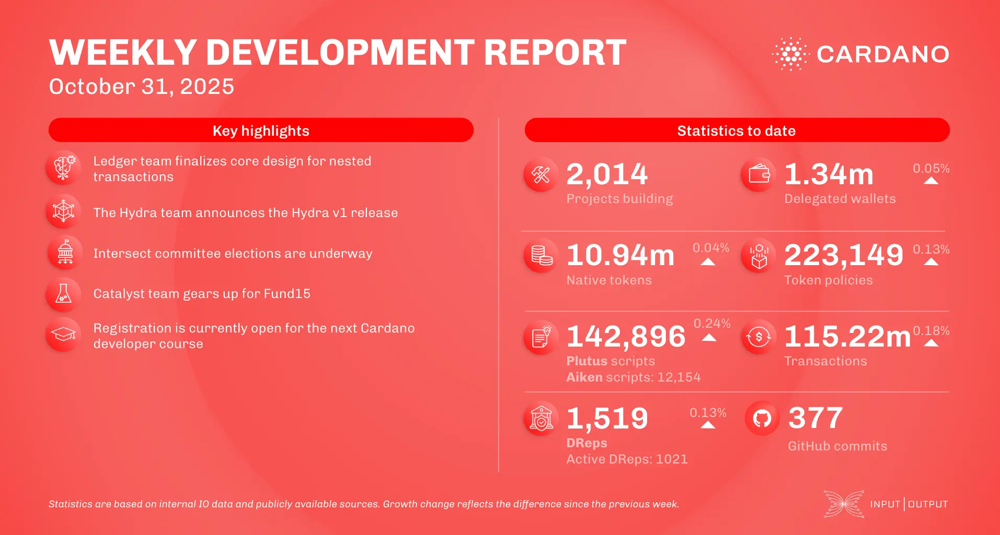

The October 31, 2025, development report highlights the Hydra v1 announcement, marking the protocol as production-ready. The ledger team also finalized CIP-118 (nested transactions/Babel fees). IOG published a deep dive on Ouroboros Phalanx, a mechanism to deter grinding attacks, and the consensus team showcased a Leios prototype. Intersect committee elections are underway, and Project Catalyst Fund15 is set to launch on November 5.

 [**Read more**](https://www.essentialcardano.io/development-update/weekly-development-report-as-of-2025-10-31) 

 

