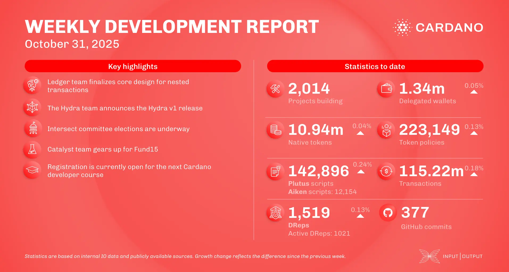

The Hydra team announced the launch of v1, marking the protocol as production-ready. The ledger team finalized CIP-118, introducing nested transactions and Babel fees, while IOG published a deep dive on Ouroboros Phalanx to deter grinding attacks. Additionally, the consensus team showcased a Leios prototype, Intersect committee elections are currently underway, and Project Catalyst Fund15 is preparing for its official launch.

 [**Read more**](https://www.essentialcardano.io/development-update/weekly-development-report-as-of-2025-10-31) 

 

