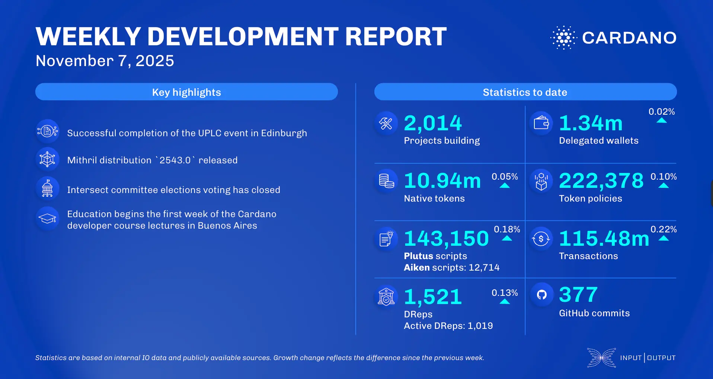

The November 07, 2025, development report highlights the Plutus team's hosting of UPLC 2025 and the addition of a new `scaleValue` primitive for the upcoming intra-era hard fork. Scaling updates include Mithril's release of distribution 2543.0 with enhanced database restoration and the Hydra team's v1.1.0 release. Intersect committee election voting concluded, with results expected on November 14. Ecosystem news features the Ouroboros Phalanx upgrade and a new Compact DApps category for Catalyst Fund15.

 [**Read more**](https://www.essentialcardano.io/development-update/weekly-development-report-as-of-2025-11-07) 

 

