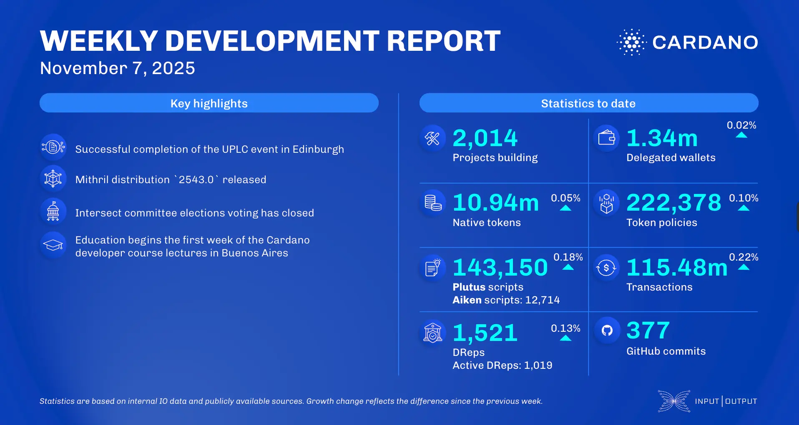

The Plutus team hosted UPLC 2025 and introduced the scaleValue primitive for the upcoming hard fork. Scaling advancements include the Mithril 2543.0 distribution and the Hydra v1.1.0 release, while Intersect concluded its committee election voting. Additionally, the Ouroboros Phalanx upgrade was introduced alongside a new Compact DApps category for Project Catalyst Fund15.

 [**Read more**](https://www.essentialcardano.io/development-update/weekly-development-report-as-of-2025-11-07) 

 

