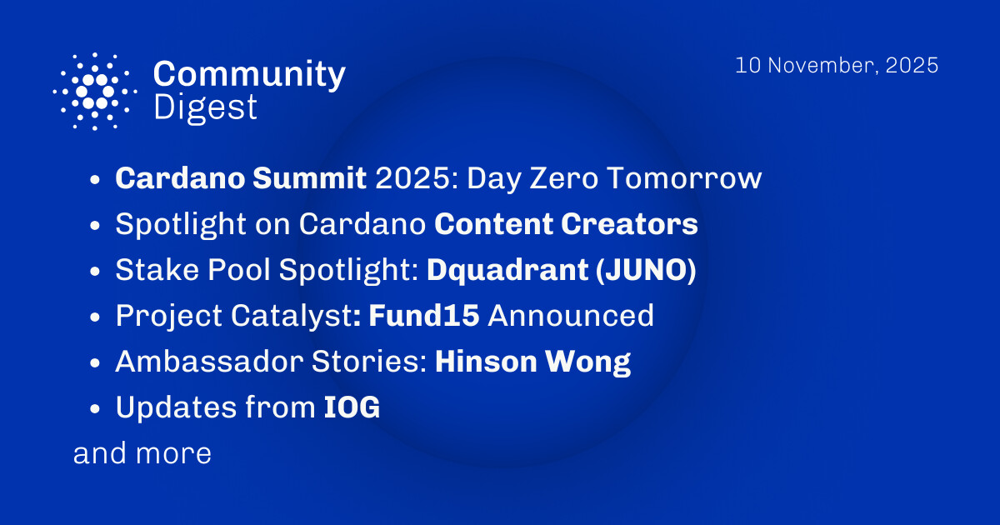

The November 10, 2025, Cardano Community Digest highlights the anticipation for Day Zero of the Cardano Summit 2025. It features spotlights on various content creators and the DQuadrant JUNO stake pool. The edition announces the launch of Project Catalyst Fund15 and shares the ambassador story of Hinson Wong. Additionally, it covers recent technical updates from IOG regarding ecosystem advancements and infrastructure developments.

 [**Read more**](https://forum.cardano.org/t/digest-november-10-2025-cardano-summit-2025-day-zero-tomorrow-spotlight-on-cardano-content-creators-stake-pool-spotlight-dquadrant-juno-project-catalyst-fund15-announced-ambassador-stories-hinson-wong-updates-from-iog/151043) 

 

